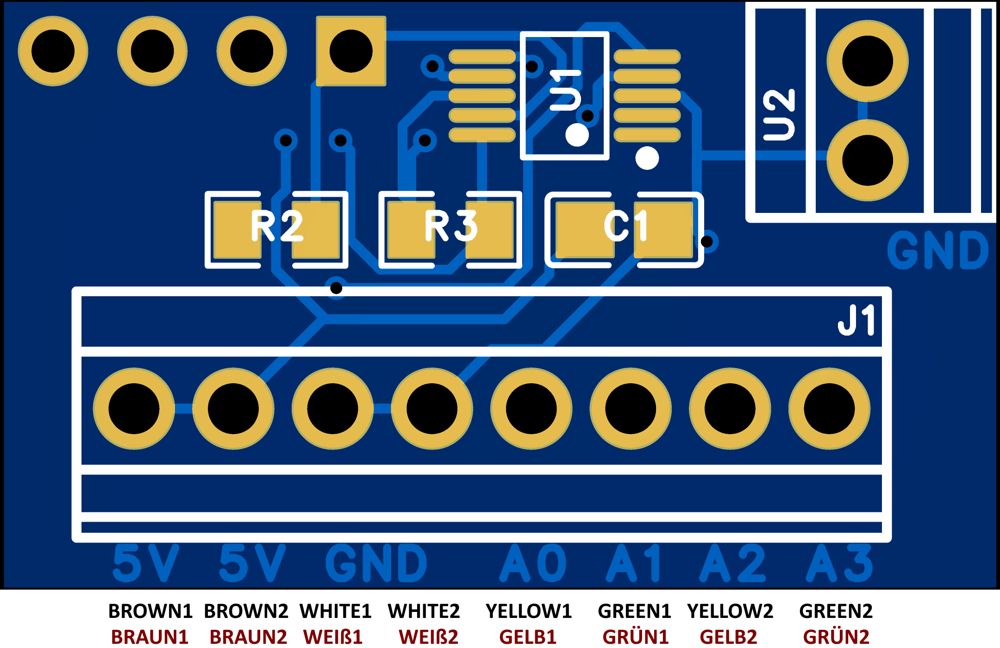

# Dragino SN50V3-LS ADS1115 Firmware (Solar Edition)

Dieses Repository enthält die modifizierte Open-Source-Firmware für das **Dragino SN50V3-LS** LoRaWAN-Sensor-Modul mit Solar-Ladeunterstützung. 

Die Firmware wurde speziell für das Auslesen von **4 zusätzlichen analogen Messkanälen** über einen externen **ADS1115 16-Bit ADC** angepasst. Zu diesem Zweck bedient sie primär die I2C-Schnittstelle.

Das Projekt wird auf GitHub unter **[OpenSprinklerShop/SN50V3-LS-ADS](https://github.com/OpenSprinklerShop/SN50V3-LS-ADS)** publiziert.

---

## 1. Features & Modifikationen

*   **ADS1115 Integration**: Kontinuierliches Auslesen der 4 Analogkanäle des ADS1115 über I2C.
*   **Fokussierter Payload**: Reduzierung der LoRaWAN-Uplinks auf die wesentlichen Daten: Batteriestand, interner ADC1 (PA4), interner ADC3 (PA8) sowie die 4 Kanäle des ADS1115 (jeweils als 16-Bit-Werte).
*   **Deaktivierung der MOD-Modi**: Die ursprüngliche `AT+MOD`-Funktion wurde vollständig deaktiviert. Die Firmware läuft ausschließlich in diesem dedizierten Messmodus, um maximale Effizienz, Stabilität und extrem niedrigen Stromverbrauch im Sleep-Modus zu garantieren.

---

## 2. Hardware-Anschluss & Verkabelung

Der ADS1115 wird an die 11-polige Klemmleiste des SN50V3-LS angeschlossen. Der ADS1115 benötigt 5V Betriebsspannung und wird über den geschalteten Pin 2 versorgt. Um Energie zu sparen und Einschaltströme zu stabilisieren, schaltet die Firmware den 5V-Pin **1000ms** vor der Messung ein und schaltet ihn direkt nach der Messung wieder aus.

### Anschlussbelegung (Pinout)

| Klemme (Pin) | Bezeichnung | ADS1115 Pin | Beschreibung |
| :---: | :--- | :---: | :--- |
| **1** | 3.3V Dauerspannung | - | Nicht belegen für ADS1115 |
| **2** | **+5V geschaltet** | **VDD / VCC** | Betriebsspannung ADS1115 (wird gesteuert) |
| **3** | PA4 (ADC1) | - | Analogeingang für SMT50-Temperatur (max. 1.1V nutzbar) |
| **4** | **SCL** | **SCL** | I2C Clock (Software-I2C auf PA14) |
| **5** | **SDA** | **SDA** | I2C Data (Software-I2C auf PA15) |
| **6** | PC13 | - | Digitaler I/O |
| **7** | PB9 | - | Digitaler I/O |
| **8** | PB8 | - | Digitaler I/O |
| **9** | PA8 (ADC3) | - | Analogeingang für SMT50-Temperatur (max. 1.1V nutzbar) |
| **10**| PB15 | - | Digitaler I/O |
| **11**| **GND** | **GND & ADDR**| Masse-Bezug & Adresse (ADDR auf GND = `0x48`) |

### Wichtige Hardware-Hinweise:
*   **I2C Pull-Up Widerstände**: Stellen Sie sicher, dass auf Ihrem ADS1115-Breakout-Board bereits Pull-Up-Widerstände (z.B. 4.7kΩ oder 10kΩ nach 5V/3.3V) für SDA und SCL verbaut sind. Falls nicht, müssen diese extern hinzugefügt werden.
*   **Referenzspannung & Signalpegel**: Da der ADS1115 hier mit 5V versorgt wird, ist die Spannungsversorgung vollständig 5V-konform. An den analogen Eingängen des ADS1115 dürfen Spannungen von bis zu 5V (maximal 5.3V) anliegen. Die Pegel der I2C-Leitungen (SDA/SCL) sind dank Open-Drain-Schaltung auf der MCU-Seite 3.3V-kompatibel (die meisten ADS1115-Boards funktionieren problemlos direkt mit den 3.3V-I2C-Leitungen des SN50V3-LS).

### 2.1 Sonderfall: Anschluss von 2 Truebner SMT50 Sensoren

Der **Truebner SMT50** ist ein hochpräziser Sensor, der gleichzeitig Bodenfeuchte und Bodentemperatur als analoge Spannungssignale ausgibt. Da für zwei SMT50-Sensoren insgesamt **4 analoge Kanäle** benötigt werden, können diese perfekt an die 4 Eingänge (A0–A3) des ADS1115 angeschlossen werden.

#### Aderbelegung des Truebner SMT50:
*   **Braun**: Stromversorgung (VCC, 3.3V bis 30V DC)
*   **Weiß**: Masse (GND)
*   **Gelb**: Analogausgang Bodenfeuchte (0..3 V entspricht 0..50% volumetric water content / VWC)
*   **Grün**: Analogausgang Temperatur (T = (U − 0,5 V) × 100; Messbereich −20 °C bis +85 °C entspricht 0,3 V bis 1,35 V)

#### Anschlussbelegung für 2x SMT50 am SN50V3-LS / ADS1115:
Beide Sensoren werden über den geschalteten 5V-Ausgang (Klemme 2) des SN50V3-LS versorgt. Das spart im Schlafmodus Energie und schützt die Sensoren.

| Sensor | Aderfarbe | Signaltyp | ADS1115 Pin / Kanal | SN50 Klemme | Beschreibung |
| :--- | :--- | :--- | :---: | :---: | :--- |
| **Sensor 1** | **Braun** | Power (VCC) | - | **2** (+5V geschaltet) | Gemeinsame Stromversorgung |
| **Sensor 1** | **Weiß** | Ground (GND) | - | **11** (GND) | Gemeinsame Masse |
| **Sensor 1** | **Gelb** | Bodenfeuchte | **A0** | - | Messkanal Bodenfeuchte SMT50 #1 |
| **Sensor 1** | **Grün** | Temperatur | **A1** | - | Messkanal Temperatur SMT50 #1 |
| **Sensor 2** | **Braun** | Power (VCC) | - | **2** (+5V geschaltet) | Gemeinsame Stromversorgung |
| **Sensor 2** | **Weiß** | Ground (GND) | - | **11** (GND) | Gemeinsame Masse |
| **Sensor 2** | **Gelb** | Bodenfeuchte | **A2** | - | Messkanal Bodenfeuchte SMT50 #2 |
| **Sensor 2** | **Grün** | Temperatur | **A3** | - | Messkanal Temperatur SMT50 #2 |

#### Anschlussbild SMT50



#### SMT50 Kanalzuordnung

Ein SMT50 belegt je **2 ADS1115-Kanäle** (ein Analogausgang für Feuchte, einer für Temperatur):

*   **SMT50 #1** → A0 = Feuchte, A1 = Temperatur
*   **SMT50 #2** → A2 = Feuchte, A3 = Temperatur

Die vier Kanäle werden als Rohwerte `ads1115_ch0 … ch3` (16-Bit) im LoRaWAN-Payload übertragen; die Umrechnung in % VWC und °C erfolgt im Payload-Decoder (siehe Abschnitt 4.1). Als Referenz entsprechen die Formeln dem Truebner SMT50: Feuchte % VWC = V × 50/3, Temperatur °C = (V − 0,5) × 100 (0,5 V = 0 °C, +10 mV/°C).

### 2.2 Erweiterter Anschluss: 3x Truebner SMT50

Für ein System mit **drei Truebner SMT50-Sensoren** werden die drei Feuchte-Signale (0..3V) an die ADS1115-Kanäle A0, A1 und A2 gelegt. Die Temperatur-Signale (max. ~1V) werden über die internen ADC-Eingänge PA4 und PA8 sowie den noch freien ADS1115-Kanal A3 erfasst. So liefern **alle drei Sensoren Feuchte und Temperatur**.

#### Anschlussbelegung für 3x SMT50:

| Sensor | Aderfarbe | Signaltyp | Ziel Pin / Kanal | SN50 Klemme | Beschreibung |
| :--- | :--- | :--- | :---: | :---: | :--- |
| **Sensor 1** | **Braun** | Power (VCC) | - | **2** (+5V geschaltet) | Stromversorgung |
| **Sensor 1** | **Weiß** | Ground (GND) | - | **11** (GND) | Masse |
| **Sensor 1** | **Gelb** | Bodenfeuchte | **ADS1115 A0** | - | SMT50 #1 Feuchte |
| **Sensor 1** | **Grün** | Temperatur | **PA4 (ADC1)** | **3** | SMT50 #1 Temperatur |
| **Sensor 2** | **Braun** | Power (VCC) | - | **2** (+5V geschaltet) | Stromversorgung |
| **Sensor 2** | **Weiß** | Ground (GND) | - | **11** (GND) | Masse |
| **Sensor 2** | **Gelb** | Bodenfeuchte | **ADS1115 A1** | - | SMT50 #2 Feuchte |
| **Sensor 2** | **Grün** | Temperatur | **PA8 (ADC3)** | **9** | SMT50 #2 Temperatur |
| **Sensor 3** | **Braun** | Power (VCC) | - | **2** (+5V geschaltet) | Stromversorgung |
| **Sensor 3** | **Weiß** | Ground (GND) | - | **11** (GND) | Masse |
| **Sensor 3** | **Gelb** | Bodenfeuchte | **ADS1115 A2** | - | SMT50 #3 Feuchte |
| **Sensor 3** | **Grün** | Temperatur | **ADS1115 A3** | - | SMT50 #3 Temperatur |

#### Hinweis zur Konfiguration:
*   **Bodenfeuchte (0..3V) liegt immer am ADS1115** (A0, A1, A2), da PA4/PA8 nur bis 1.1V messen können.
*   **PA4 und PA8** übernehmen die Temperatur von Sensor #1 und #2; die Temperatur von Sensor #3 wird über den freien ADS1115-Kanal A3 erfasst.
*   Im Payload-Decoder (siehe Abschnitt 4.3) werden die Temperaturen von #1/#2 aus `adc_pa4_mv`/`adc_pa8_mv` und die von #3 aus ADS1115 A3 berechnet.

### 2.3 Maximal-Konfiguration: 4x Truebner SMT50

Für maximale Sensorabdeckung können **vier Truebner SMT50-Sensoren** angeschlossen werden. Da die Bodenfeuchte (0..3V) zwingend am ADS1115 gemessen werden muss, belegen die **vier Feuchte-Signale alle Kanäle A0..A3**. Die internen Eingänge PA4 und PA8 (max. 1.1V) übernehmen die Temperatur von zwei der Sensoren; die übrigen zwei Sensoren liefern nur Feuchte.

#### Anschlussbelegung für 4x SMT50:

| Sensor | Aderfarbe | Signaltyp | Ziel Pin / Kanal | SN50 Klemme | Beschreibung |
| :--- | :--- | :--- | :---: | :---: | :--- |
| **Sensor 1** | **Braun** | Power (VCC) | - | **2** (+5V geschaltet) | Stromversorgung |
| **Sensor 1** | **Weiß** | Ground (GND) | - | **11** (GND) | Masse |
| **Sensor 1** | **Gelb** | Bodenfeuchte | **ADS1115 A0** | - | SMT50 #1 Feuchte |
| **Sensor 1** | **Grün** | Temperatur | **PA4 (ADC1)** | **3** | SMT50 #1 Temperatur |
| **Sensor 2** | **Braun** | Power (VCC) | - | **2** (+5V geschaltet) | Stromversorgung |
| **Sensor 2** | **Weiß** | Ground (GND) | - | **11** (GND) | Masse |
| **Sensor 2** | **Gelb** | Bodenfeuchte | **ADS1115 A1** | - | SMT50 #2 Feuchte |
| **Sensor 2** | **Grün** | Temperatur | **PA8 (ADC3)** | **9** | SMT50 #2 Temperatur |
| **Sensor 3** | **Braun** | Power (VCC) | - | **2** (+5V geschaltet) | Stromversorgung |
| **Sensor 3** | **Weiß** | Ground (GND) | - | **11** (GND) | Masse |
| **Sensor 3** | **Gelb** | Bodenfeuchte | **ADS1115 A2** | - | SMT50 #3 Feuchte |
| **Sensor 3** | **Grün** | (nicht verbunden) | - | - | Keine Temperatur für Sensor 3 |
| **Sensor 4** | **Braun** | Power (VCC) | - | **2** (+5V geschaltet) | Stromversorgung |
| **Sensor 4** | **Weiß** | Ground (GND) | - | **11** (GND) | Masse |
| **Sensor 4** | **Gelb** | Bodenfeuchte | **ADS1115 A3** | - | SMT50 #4 Feuchte |
| **Sensor 4** | **Grün** | (nicht verbunden) | - | - | Keine Temperatur für Sensor 4 |

#### Hinweis zur Konfiguration:
*   **Alle vier ADS1115-Kanäle A0..A3 tragen Bodenfeuchte** (je ein Sensor), da PA4/PA8 nur bis 1.1V messen können.
*   **PA4 und PA8** übernehmen die Temperatur von Sensor #1 und #2. Für #3 und #4 steht keine Temperatur zur Verfügung.
*   Wird für #3/#4 ebenfalls Temperatur benötigt, muss die Sensoranzahl reduziert werden (siehe 3x-Konfiguration mit A3 als zusätzlichem Temperaturkanal).
*   Im Payload-Decoder (siehe Abschnitt 4.4) werden die Temperaturen von #1/#2 aus `adc_pa4_mv`/`adc_pa8_mv` berechnet.

### Montage & Inbetriebnahme

1. **Platine ausbauen:** Schrauben Sie die Hauptplatine aus dem Gehäuse, um ausreichend Platz für das Anklemmen der Sensoradern zu haben.
2. **Verkabeln:** Führen Sie die Sensorkabel des SMT50 durch die PG-Verschraubungen **und durch die Zweier-Dichtung**, die sich in der Packung befindet, und schließen Sie die Adern an den Schraubklemmen der Zusatzplatine an.
3. **Platine einbauen:** Platine wieder sicher im Gehäuse verschrauben. Je nach Platz eventuell nur mit 2 Schrauben.
4. **Stromversorgung aktivieren:** Setzen Sie den gelben Jumper (Power) auf der Platine, um das Gerät mit der Batterie zu verbinden.

---

## 3. LoRaWAN Payload-Format (14 Bytes)

Jeder Uplink besteht aus exakt **14 Bytes** im Big-Endian-Format (MSB zuerst).

| Byte-Index | Name | Datentyp | Wertebereich / Skalierung | Beschreibung |
| :---: | :--- | :---: | :---: | :--- |
| **0 - 1** | Batterie-Spannung | `uint16` | z.B. 3600 | Batteriespannung in Millivolt (mV) |
| **2 - 3** | ADC1 (PA4) | `uint16` | z.B. 900 | Interner Analogwert PA4 (SMT50-Temperaturbereich, max. 1.1V) |
| **4 - 5** | ADC3 (PA8) | `uint16` | z.B. 900 | Interner Analogwert PA8 (SMT50-Temperaturbereich, max. 1.1V) |
| **6 - 7** | ADS1115 Kanal 0 | `int16` | `0` bis `32767` | Raw-Wert ADS1115 A0 (0V = 0, 4.096V = 32767; 1 LSB = 0.125 mV) |
| **8 - 9** | ADS1115 Kanal 1 | `int16` | `0` bis `32767` | Raw-Wert ADS1115 A1 (0V = 0, 4.096V = 32767; 1 LSB = 0.125 mV) |
| **10 - 11**| ADS1115 Kanal 2 | `int16` | `0` bis `32767` | Raw-Wert ADS1115 A2 (0V = 0, 4.096V = 32767; 1 LSB = 0.125 mV) |
| **12 - 13**| ADS1115 Kanal 3 | `int16` | `0` bis `32767` | Raw-Wert ADS1115 A3 (0V = 0, 4.096V = 32767; 1 LSB = 0.125 mV) |

### 3.1 Payload-Mapping für 2x Truebner SMT50 (Konfiguration mit ADS1115)

Wenn zwei Truebner SMT50-Sensoren wie in Abschnitt 2.1 beschrieben an den ADS1115 angeschlossen sind, ordnen sich die Bytes wie folgt zu:

| Byte-Index | Name | Datentyp | SMT50 Zuordnung | Beschreibung / Wertebereich |
| :---: | :--- | :---: | :---: | :--- |
| **0 - 1** | Batterie-Spannung | `uint16` | - | Batteriespannung in Millivolt (mV) |
| **2 - 3** | ADC1 (PA4) | `uint16` | - | Interner Analogwert PA4 (freier Eingang, in mV) |
| **4 - 5** | ADC3 (PA8) | `uint16` | - | Interner Analogwert PA8 (freier Eingang, in mV) |
| **6 - 7** | ADS1115 Kanal 0 | `int16` | **SMT50 #1 Bodenfeuchte** | Raw-Wert (0V = 0, 3V = 24000, entspricht 0 bis 50% VWC) |
| **8 - 9** | ADS1115 Kanal 1 | `int16` | **SMT50 #1 Temperatur** | Raw-Wert (0.3V = 2400, 1.35V = 10800, entspricht -20 bis +85 °C) |
| **10 - 11**| ADS1115 Kanal 2 | `int16` | **SMT50 #2 Bodenfeuchte** | Raw-Wert (0V = 0, 3V = 24000, entspricht 0 bis 50% VWC) |
| **12 - 13**| ADS1115 Kanal 3 | `int16` | **SMT50 #2 Temperatur** | Raw-Wert (0.3V = 2400, 1.35V = 10800, entspricht -20 bis +85 °C) |

### 3.2 Payload-Mapping für 3x Truebner SMT50 (Konfiguration mit ADS1115 + PA4 + PA8)

Wenn drei Truebner SMT50-Sensoren wie in Abschnitt 2.2 beschrieben angeschlossen sind (Feuchte auf A0..A2, Temperatur auf PA4, PA8 und A3):

| Byte-Index | Name | Datentyp | SMT50 Zuordnung | Beschreibung / Wertebereich |
| :---: | :--- | :---: | :---: | :--- |
| **0 - 1** | Batterie-Spannung | `uint16` | - | Batteriespannung in Millivolt (mV) |
| **2 - 3** | ADC1 (PA4) | `uint16` | **SMT50 #1 Temperatur** | Direkter ADC-Wert PA4 (0.2..1.0V typisch, max. 1.1V nutzbar) |
| **4 - 5** | ADC3 (PA8) | `uint16` | **SMT50 #2 Temperatur** | Direkter ADC-Wert PA8 (0.2..1.0V typisch, max. 1.1V nutzbar) |
| **6 - 7** | ADS1115 Kanal 0 | `int16` | **SMT50 #1 Bodenfeuchte** | Raw-Wert (0V = 0, 3V = 24000, entspricht 0 bis 50% VWC) |
| **8 - 9** | ADS1115 Kanal 1 | `int16` | **SMT50 #2 Bodenfeuchte** | Raw-Wert (0V = 0, 3V = 24000, entspricht 0 bis 50% VWC) |
| **10 - 11**| ADS1115 Kanal 2 | `int16` | **SMT50 #3 Bodenfeuchte** | Raw-Wert (0V = 0, 3V = 24000, entspricht 0 bis 50% VWC) |
| **12 - 13**| ADS1115 Kanal 3 | `int16` | **SMT50 #3 Temperatur** | Raw-Wert (0.3V = 2400, 1.35V = 10800, entspricht -20 bis +85 °C) |

**Hinweis:** Die Feuchte aller drei Sensoren liegt am ADS1115 (A0..A2). Die Temperaturen von #1/#2 stammen aus PA4/PA8, die von #3 aus ADS1115 A3. Die Temperaturformeln bleiben unverändert und passen zum relevanten SMT50-Bereich von ca. 0.2..1.0V.

### 3.3 Payload-Mapping für 4x Truebner SMT50 (Vollständige Konfiguration mit ADS1115 + PA4 + PA8)

Wenn vier Truebner SMT50-Sensoren wie in Abschnitt 2.3 beschrieben angeschlossen sind (Feuchte aller vier Sensoren auf A0..A3, Temperatur von #1/#2 auf PA4/PA8):

| Byte-Index | Name | Datentyp | SMT50 Zuordnung | Beschreibung / Wertebereich |
| :---: | :--- | :---: | :---: | :--- |
| **0 - 1** | Batterie-Spannung | `uint16` | - | Batteriespannung in Millivolt (mV) |
| **2 - 3** | ADC1 (PA4) | `uint16` | **SMT50 #1 Temperatur** | Direkter ADC-Wert PA4 (0.2..1.0V typisch, max. 1.1V nutzbar) |
| **4 - 5** | ADC3 (PA8) | `uint16` | **SMT50 #2 Temperatur** | Direkter ADC-Wert PA8 (0.2..1.0V typisch, max. 1.1V nutzbar) |
| **6 - 7** | ADS1115 Kanal 0 | `int16` | **SMT50 #1 Bodenfeuchte** | Raw-Wert (0V = 0, 3V = 24000, entspricht 0 bis 50% VWC) |
| **8 - 9** | ADS1115 Kanal 1 | `int16` | **SMT50 #2 Bodenfeuchte** | Raw-Wert (0V = 0, 3V = 24000, entspricht 0 bis 50% VWC) |
| **10 - 11**| ADS1115 Kanal 2 | `int16` | **SMT50 #3 Bodenfeuchte** | Raw-Wert (0V = 0, 3V = 24000, entspricht 0 bis 50% VWC) |
| **12 - 13**| ADS1115 Kanal 3 | `int16` | **SMT50 #4 Bodenfeuchte** | Raw-Wert (0V = 0, 3V = 24000, entspricht 0 bis 50% VWC) |

**Hinweis:** Alle vier ADS1115-Kanäle A0..A3 tragen Bodenfeuchte (je ein Sensor). Die Temperaturen von #1/#2 stammen aus PA4/PA8; #3 und #4 liefern keine Temperatur. Die Temperaturformel bleibt unverändert und passt zum relevanten SMT50-Bereich von ca. 0.2..1.0V.

---

## 4. Payload-Dekodierung (The Things Network v3 / ChirpStack)

Der ADS1115 liefert einen vorzeichenbehafteten 16-Bit-Wert (`int16`). Der Messbereich hängt **nicht** von der Betriebsspannung (5V) ab, sondern von der internen Referenz und der PGA-Einstellung. Die Firmware verwendet PGA = 001, d.h. **±4.096 V Full Scale**: `0V` entspricht dem Wert `0`, `4.096V` dem Maximalwert `32767`, ein LSB entspricht **0.125 mV**. Spannungen oberhalb von 4.096V (bis zur Betriebsspannung von 5V) sind elektrisch zulässig, werden aber auf `32767` begrenzt (Sättigung).

### Berechnungsformeln:
$$\text{Spannung (V)} = \frac{\text{Raw-Wert}}{32768} \times 4.096 = \text{Raw-Wert} \times 0.000125$$
$$\text{Spannung (mV)} = \frac{\text{Raw-Wert}}{32768} \times 4096 = \text{Raw-Wert} \times 0.125$$

### Wichtiger Hinweis zu unbeschalteten (schwebenden) Pins:
Wenn an den Kanälen (A0–A3) des ADS1115 **nichts** angeschlossen ist, befinden sich die Eingänge im **schwebenden Zustand (floating)**. Sie fangen minimale statische Aufladungen der Umgebung ein, wodurch typischerweise Rauschen im Bereich von **`4300` bis `4400`** (entspricht ca. 0.54V) gemessen wird. Dies ist völlig normal.
*   Wird ein Pin direkt mit **GND** verbunden, fällt der Wert sofort auf **`0`**.
*   Wird ein Pin direkt mit **5V** verbunden, steigt der Wert auf **`32767`** (Sättigung: jede Spannung ab 4.096V ergibt den Maximalwert).

### Beispiel-Uplink (Hex):
`0E 1C 03 84 03 84 4E 20 00 00 1B 58 7F FF`

*   `0E 1C` (Byte 0-1) = `3612` -> **3612 mV** (Batterie)
*   `03 84` (Byte 2-3) = `900` -> **900 mV** (ADC1 / PA4)
*   `03 84` (Byte 4-5) = `900` -> **900 mV** (ADC3 / PA8)
*   `4E 20` (Byte 6-7) = `20000` -> $20000 \times 0.125\text{ mV} =$ **2500 mV (2.50V)** (ADS1115 A0)
*   `00 00` (Byte 8-9) = `0` -> **0 mV (0V)** (ADS1115 A1)
*   `1B 58` (Byte 10-11) = `7000` -> $7000 \times 0.125\text{ mV} =$ **875 mV (0.875V)** (ADS1115 A2)
*   `7F FF` (Byte 12-13) = `32767` -> **≥ 4096 mV (Messbereichsende / Sättigung)** (ADS1115 A3)

### 4.1 JavaScript Decoder für generisches Payload-Format

Der generische Decoder konvertiert alle 14 Bytes in Spannungswerte (mV) ohne Spezialisierung auf bestimmte Sensoren. Diese Variante ist verwendbar für beliebige analoge Eingänge.

**Verfügbar in separater Datei:** [`payload_decoder_generic.js`](payload_decoder_generic.js)

```javascript
function decodeUplink(input) {
  var bytes = input.bytes;
  var decoded = {};

  if (bytes.length === 14) {
    // 1. Batterie-Spannung (mV)
    decoded.battery_mv = (bytes[0] << 8) | bytes[1];

    // 2. Interner ADC1 (PA4) in mV
    decoded.adc_pa4_mv = (bytes[2] << 8) | bytes[3];

    // 3. Interner ADC3 (PA8) in mV
    decoded.adc_pa8_mv = (bytes[4] << 8) | bytes[5];

    // Hilfsfunktion für signed 16-bit
    function readInt16(b1, b2) {
      var val = (b1 << 8) | b2;
      return val >= 0x8000 ? val - 0x10000 : val;
    }

    // 4. ADS1115 Kanäle (umgerechnet in mV basierend auf 0..5V-Skalierung)
    var ch0_raw = readInt16(bytes[6], bytes[7]);
    var ch1_raw = readInt16(bytes[8], bytes[9]);
    var ch2_raw = readInt16(bytes[10], bytes[11]);
    var ch3_raw = readInt16(bytes[12], bytes[13]);

    // I2C-Fehler: Die Firmware sendet dann auf ALLEN vier Kanälen 0xFFFF (= -1).
    // Ein einzelnes -1 ist dagegen ein gültiger Messwert (Offset bei 0V) und wird auf 0 begrenzt.
    var i2cError = (ch0_raw === -1 && ch1_raw === -1 && ch2_raw === -1 && ch3_raw === -1);

    decoded.ads1115_a0_mv = i2cError ? null : Math.round(Math.max(ch0_raw, 0) * 0.125);
    decoded.ads1115_a1_mv = i2cError ? null : Math.round(Math.max(ch1_raw, 0) * 0.125);
    decoded.ads1115_a2_mv = i2cError ? null : Math.round(Math.max(ch2_raw, 0) * 0.125);
    decoded.ads1115_a3_mv = i2cError ? null : Math.round(Math.max(ch3_raw, 0) * 0.125);
  }

  return {
    data: decoded,
    warnings: [],
    errors: []
  };
}
```

### 4.2 JavaScript Decoder für 2x Truebner SMT50

Wenn zwei Truebner SMT50-Sensoren angeschlossen sind, konvertiert der folgende Decoder die Rohwerte direkt in Bodenfeuchte (% VWC) und Temperatur (°C).

Dabei wird die korrekte Gain-Skalierung des ADS1115 (PGA = 001, d.h. ±4.096 V Messbereich) berücksichtigt:
*   **Formel Spannung:** $V = \frac{\text{Raw}}{32768} \times 4.096 = \text{Raw} \times 0.000125$
*   **Formel Bodenfeuchte:** $\text{Feuchtigkeit (\% VWC)} = V \times \frac{50}{3} = \frac{\text{Raw}}{480}$
*   **Formel Temperatur:** $\text{Temperatur (°C)} = (V - 0.5) \times 100 = \frac{\text{Raw}}{80} - 50$

**Verfügbar in separater Datei:** [`payload_decoder_2x_smt50.js`](payload_decoder_2x_smt50.js)

```javascript
function decodeUplink(input) {
  var bytes = input.bytes;
  var decoded = {};

  if (bytes.length === 14) {
    // 1. Batterie-Spannung (mV)
    decoded.battery_mv = (bytes[0] << 8) | bytes[1];

    // 2. Interner ADC1 (PA4) in mV
    decoded.adc_pa4_mv = (bytes[2] << 8) | bytes[3];

    // 3. Interner ADC3 (PA8) in mV
    decoded.adc_pa8_mv = (bytes[4] << 8) | bytes[5];

    // Hilfsfunktion für signed 16-bit
    function readInt16(b1, b2) {
      var val = (b1 << 8) | b2;
      return val >= 0x8000 ? val - 0x10000 : val;
    }

    // ADS1115 Kanäle auslesen (PGA = ±4.096V Full Scale)
    var ch0_raw = readInt16(bytes[6], bytes[7]);   // SMT50 #1 Bodenfeuchte (Gelb)
    var ch1_raw = readInt16(bytes[8], bytes[9]);   // SMT50 #1 Temperatur (Grün)
    var ch2_raw = readInt16(bytes[10], bytes[11]); // SMT50 #2 Bodenfeuchte (Gelb)
    var ch3_raw = readInt16(bytes[12], bytes[13]); // SMT50 #2 Temperatur (Grün)

    // I2C-Fehler: Die Firmware sendet dann auf ALLEN vier Kanälen 0xFFFF (= -1).
    // Ein einzelnes -1 ist dagegen ein gültiger Messwert (Offset bei 0V) und wird auf 0 begrenzt.
    var i2cError = (ch0_raw === -1 && ch1_raw === -1 && ch2_raw === -1 && ch3_raw === -1);

    // Berechnung und Validierung für Sensor 1
    if (i2cError) {
      decoded.smt50_1_moisture_vwc = null;
    } else {
      var moisture1 = Math.max(ch0_raw, 0) / 480.0;
      decoded.smt50_1_moisture_vwc = parseFloat(moisture1.toFixed(2));
    }

    if (i2cError) {
      decoded.smt50_1_temp_c = null;
    } else {
      var temp1 = (Math.max(ch1_raw, 0) / 80.0) - 50.0;
      decoded.smt50_1_temp_c = parseFloat(temp1.toFixed(1));
    }

    // Berechnung und Validierung für Sensor 2
    if (i2cError) {
      decoded.smt50_2_moisture_vwc = null;
    } else {
      var moisture2 = Math.max(ch2_raw, 0) / 480.0;
      decoded.smt50_2_moisture_vwc = parseFloat(moisture2.toFixed(2));
    }

    if (i2cError) {
      decoded.smt50_2_temp_c = null;
    } else {
      var temp2 = (Math.max(ch3_raw, 0) / 80.0) - 50.0;
      decoded.smt50_2_temp_c = parseFloat(temp2.toFixed(1));
    }
  }

  return {
    data: decoded,
    warnings: [],
    errors: []
  };
}
```

### 4.3 JavaScript Decoder für 3x Truebner SMT50

Für ein System mit drei Sensoren (Feuchte auf A0..A2, Temperatur auf PA4, PA8 und A3) wird der folgende Decoder verwendet:

**Verfügbar in separater Datei:** [`payload_decoder_3x_smt50.js`](payload_decoder_3x_smt50.js)

**Hinweis:** Die Bodenfeuchte aller drei Sensoren liegt am ADS1115 (A0..A2), da PA4/PA8 nur bis 1.1V messen. Die Temperaturen von #1/#2 stammen aus PA4/PA8, die von #3 aus ADS1115 A3.

### 4.4 JavaScript Decoder für 4x Truebner SMT50

Für ein System mit vier Sensoren (Feuchte aller vier Sensoren auf A0..A3, Temperatur von #1/#2 auf PA4/PA8) wird der folgende Decoder verwendet:

**Verfügbar in separater Datei:** [`payload_decoder_4x_smt50.js`](payload_decoder_4x_smt50.js)

**Hinweis:** Alle vier ADS1115-Kanäle A0..A3 tragen Bodenfeuchte, da PA4/PA8 nur bis 1.1V messen. Über PA4/PA8 wird zusätzlich die Temperatur von Sensor #1 und #2 erfasst; #3 und #4 liefern nur Feuchte.

---

## 5. Testen & Fehlerdiagnose über das Terminal

Über den UART-Terminal-Anschluss (COM-Port, Baudrate `9600`, Newline `CR+LF`) kann die Funktion und Verkabelung direkt getestet werden:

### AT-Testbefehl:
```text
AT+GETSENSORVALUE=0
```

### Ausgabe bei ERFOLGREICHER Erkennung (SUCCESS):
Wenn der ADS1115 korrekt verkabelt ist, aktiviert die Firmware Pin 2 (+5V), wartet 1000ms und gibt folgende Meldung aus:
```text
Bat_voltage:3612 mv
ADS1115 Connection Status: SUCCESS (ADS1115 Detected!)
ADS1115 Ch0:4394, Ch1:4384, Ch2:4365, Ch3:4369
```
*(Hinweis: Ch0..Ch3 zeigen hier schwebende Rauschwerte, da kein Sensor angeschlossen ist.)*

### Ausgabe bei FEHLERHAFTER Erkennung (FAILED):
Wenn die Verkabelung fehlerhaft ist, die Adresse nicht `0x48` ist oder keine Stromversorgung anliegt:
```text
Bat_voltage:3612 mv
ADS1115 Connection Status: FAILED (Check Address 0x48, Pin 4 SCL, Pin 5 SDA, Pin 2 +5V!)
```
In diesem Fall werden im LoRaWAN-Payload alle Kanäle als `65535` (bzw. `-1`) übertragen, was im Decoder als `null` interpretiert wird. Der Decoder wertet dies nur dann als Fehler, wenn **alle vier** Kanäle `-1` liefern – ein einzelner Wert von `-1` ist ein gültiger Messwert (der ADS1115 kann bei 0V durch Offset leicht negative Werte liefern) und wird auf `0` begrenzt.

### SMT50-Werte direkt umgerechnet ausgeben: `AT+SMT50`

Der Befehl `AT+SMT50=<Modus>` führt eine Messung durch (wie `AT+GETSENSORVALUE=0`, inkl. 1000ms 5V-Vorlaufzeit) und gibt die Messwerte direkt als Bodenfeuchte (% VWC) und Temperatur (°C) aus. Der Modus beschreibt, wie viele SMT50 angeschlossen sind und wie die Kanäle belegt sind. Es wird nichts gespeichert und kein Uplink gesendet; der LoRaWAN-Payload bleibt unverändert (Rohwerte).

| Befehl | Konfiguration | A0 | A1 | A2 | A3 | PA4 (ADC1) | PA8 (ADC3) |
| :--- | :--- | :--- | :--- | :--- | :--- | :--- | :--- |
| `AT+SMT50=1` | 1x SMT50 | Feuchte 1 | Temp 1 | - | - | - | - |
| `AT+SMT50=2` | 2x SMT50 | Feuchte 1 | Temp 1 | Feuchte 2 | Temp 2 | - | - |
| `AT+SMT50=3` | 3x SMT50 | Feuchte 1 | Feuchte 2 | Feuchte 3 | Temp 3 | - | - |
| `AT+SMT50=4` | 4x SMT50 | Feuchte 1 | Feuchte 2 | Feuchte 3 | Feuchte 4 | - | - |
| `AT+SMT50=5` | 4x SMT50 + Temperatur | Feuchte 1 | Feuchte 2 | Feuchte 3 | Feuchte 4 | Temp 1 | Temp 2 |

Umrechnung (identisch zu den Payload-Decodern): Feuchte % VWC = Raw / 480, Temperatur °C = Raw / 80 − 50, für PA4/PA8: °C = (mV − 500) / 10. Temperaturen außerhalb von −40..+100 °C (z.B. offener Eingang) werden als `null` ausgegeben.

Beispielausgabe für `AT+SMT50=2`:
```text
SMT50 mode 2
SMT50 #1 Moisture(A0): 23.45 %VWC
SMT50 #1 Temp(A1): 21.3 C
SMT50 #2 Moisture(A2): 18.02 %VWC
SMT50 #2 Temp(A3): 20.9 C
```
Ist der ADS1115 nicht erreichbar, erscheint `SMT50: ADS1115 FAILED (...)`. Andere Werte als 1..5 liefern `AT_PARAM_ERROR`.

---

## 6. Kompilieren & Installieren der Firmware

### A. Über GNU ARM GCC (Makefile)
1. Installieren Sie die ARM GCC Toolchain (`gcc-arm-none-eabi`).
2. Setzen Sie den Tremo-SDK-Pfad in Ihrer Shell:
   ```bash
   export TREMO_SDK_PATH=$(pwd)
   ```
3. Kompilieren Sie das Projekt:
   ```bash
   cd Projects/Applications/DRAGINO-LRWAN-AT
   make clean
   make
   ```
4. Die Flash-Dateien (`.bin`, `.hex`) befinden sich anschließend im generierten Build-Ordner.

### B. Über Keil uVision
1. Öffnen Sie die Projektdatei `Projects/Applications/DRAGINO-LRWAN-AT/project.uvprojx` (oder `DRAGINO-LRWAN(AT)/project.uvprojx`) in Keil MDK-ARM (v5 oder neuer).
2. Klicken Sie auf **Build (F7)**.
3. Erzeugen Sie die flashbare Binärdatei durch Ausführen der Batch-Datei im Anwendungsordner:
   ```cmd
   utils\genbinary.bat
   ```

---

## 6. Firmware flashen (Upload)

### Automatisiertes Flash-Skript (Empfohlen)
Im Root-Verzeichnis dieses Projekts befindet sich das PowerShell-Skript `flash_firmware.ps1`. Dieses Skript automatisiert den gesamten Prozess:
1. Prüft/installiert die GNU ARM GCC Toolchain (one-time Download).
2. Kompiliert die Firmware im Git-Bash-Kontext.
3. Führt einen Sicherheits-Check der Binärgröße durch (verhindert das Überschreiben der DevEUI / Keys bei `0x0803E000`).
4. Flasht das Gerät über **COM3** mit 115200 Baudrate.

**Ausführung:**
1. Schieben Sie den Board-Schalter auf **'ISP'**.
2. Drücken Sie kurz die **RESET-Taste** auf dem Board.
3. Öffnen Sie die PowerShell und führen Sie aus:
   ```powershell
   powershell -File .\flash_firmware.ps1
   ```
4. Nach erfolgreichem Flash-Vorgang den Schalter wieder auf **'Flash'** schieben und erneut **RESET** drücken.

### Manuelles Flashen
*   Detaillierte Flash-Anleitungen finden Sie in den offiziellen Handbüchern:
    *   [UART Flash Anleitung](http://wiki.dragino.com/xwiki/bin/view/Main/UART%20Access%20for%20LoRa%20ST%20v4%20base%20model/)
    *   [OTA Firmware Update](http://wiki.dragino.com/xwiki/bin/view/Main/Firmware%20OTA%20Update%20for%20Sensors/)
    *   [Original Dragino Wiki für SN50v3-LB](https://wiki.dragino.com/xwiki/bin/view/Main/User%20Manual%20for%20LoRaWAN%20End%20Nodes/SN50v3-LB/)
